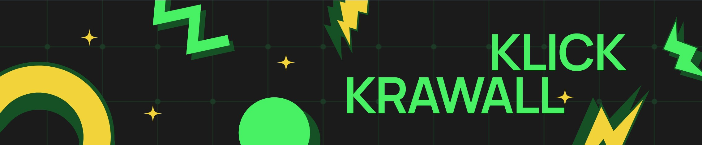
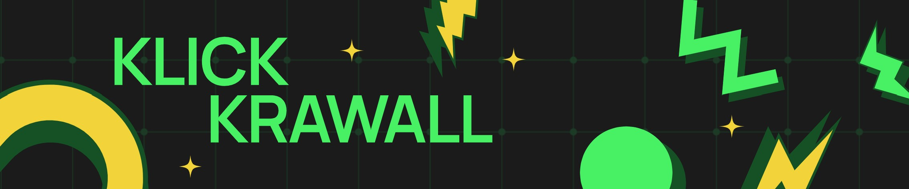

# 🎉 KlickKrawall – Das ultimative Online-Multiplayer-Partygame! 🎮

**KlickKrawall** ist ein rasantes, browserbasiertes Online-Partyspiel, bei dem schnelle Reaktionen und Teamplay aufeinandertreffen! Ob mit Freunden oder gegen Fremde – hier geht's nicht um Strategie, sondern um Klicks und Krawall.

## 🚀 Features

- ✅ **Echtzeit-Multiplayer:** Spiele mit bis zu 20 Spielern gleichzeitig!
- 🖱️ **Schnell & einfach:** Kein Download, einfach Link teilen und losklicken.
- 🕹️ **Minigames:** Abwechslungsreiche Minispiele mit eigenem Twist.
- 🌍 **Plattformunabhängig:** Spielbar auf PC, Tablet oder Smartphone.
- 🛠️ **Custom-Lobbies:** Starte private Runden mit Freunden.

## 🎮 So spielst du

1. **Spiel starten:** Gehe auf [klickkrawall.de](https://klickkrawall.netlify.app) *(URL komm noch)*  
2. **Lobby erstellen oder beitreten**  
3. **Minispiele zocken & Punkte sammeln**
4. **Spaß haben 😉**

## 🖼️ Eindrücke:

## 💪 Einbringen

Wenn du Ideen hast, inwieweit du dich im Projekt einbringen kannst oder falls dir Fehler aufgefallen sind, eröffne gerne einen Issue oder stelle einen Pull-Request.

## 🫶 Danke

Danke, dass du KlickKrawall verwendest. Euer Team ♥️

